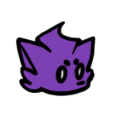

# SeiunEngine

**你知道吗：** 如果你去催促一个开发者更新你想要的内容和优化，你可能等来的并不是你想要的更新，而是停更。我很想把这一个引擎做好，但我的实力就摆在那儿，请不要过度期待。

A Friday Night Funkin' engine, forked from Psych Engine 0.6.3. Built for the Mandela Funkin Night mod.

**Note:** This project uses AI-assisted tools in its development.

**中文版：[ZHREADME.md](./ZHREADME.md)**

## Supported platforms

- Windows

- macOS
- Linux
- Android
- iOS — builds, but untested. No idea if it actually runs.

No HTML5 build.

## Building

You need Haxe 4.2.5.

```sh
haxelib setup .haxelib
haxe -cp ./setup -main Main --interp
lime build windows
```

Other targets: `lime build mac`, `lime build linux`, `lime build android`, `lime build ios -arm64`.

You can also build via the Build workflow on GitHub Actions (manual trigger, pick a platform, download the artifact).

## Dependencies

See `hmm.json`. Seven of them are forks of mine:

- flixel
- hxvlc
- extension-androidtools
- linc_luajit-rewriten
- openfl
- lime
- hscript

### Classpath overrides (engine patches, tracked in `source/`)

The engine patches a few library classes by overriding them on the `source/`
classpath. The libraries themselves are **not** vendored into this repo.

| override file | patches |
|---|---|
| `source/flixel/system/FlxSound.hx` | flixel (mohong2/flixel) |
| `source/flixel/animation/FlxAnimationController.hx` | flixel (mohong2/flixel) |
| `source/flixel/system/ui/FlxSoundTray.hx` | flixel (mohong2/flixel) |
| `source/flixel/addons/display/FlxRuntimeShader.hx` | engine-added class |
| `source/flixel/addons/ui/FlxInputText.hx` | flixel-ui |
| `source/flixel/addons/ui/FlxUIInputText.hx` | flixel-ui |
| `source/lime/_internal/backend/native/NativeAudioSource.hx` | lime |
| `source/openfl/display/FPS.hx` | openfl |
| `source/openfl/display/OldFPS.hx` | engine-added class |

> TODO: push these patches to their upstream repos (mohong2/flixel, etc.) and
> drop the `source/` overrides once the forks carry them.

## Mods

Drop mods into `mods/`. See `Modding.md`.

## Credits

-  **mo_hong** — Lead developer and maintainer, responsible for extensive engine modifications, performance optimizations, bug fixes, and Chinese localization. Also dove into countless pointers and low-level debugging to keep everything stable and running smoothly lol · [Bilibili](https://space.bilibili.com/672029688)

-  **Li.tmc** — Old engine icon (MohongEngine) · [Bilibili](https://space.bilibili.com/3537117498051255)

### SeiunEngine Acknowledgements

-  **CitriSnow** — Provided some scripting design solutions and offered continuous support throughout the engine's development · [Bilibili](https://space.bilibili.com/1951803423)

-  **MuXue** — Identified countless bugs, made significant contributions to the engine's stability and quality, and provided continuous support throughout the development process · [Bilibili](https://space.bilibili.com/3493084289566971)

-  **Pico** (not the FNF character Pico) — Has supported the engine's development since the MohongEngine era and provided valuable bug feedback · [Bilibili](https://space.bilibili.com/3546752359598592)

-  **Wolf Yeying** — Found and reported several bugs, contributing to the engine's stable operation · [Bilibili](https://space.bilibili.com/3493115727972533)

-  **一只可爱的bf呀** — Provided moral support and some ideas lol · [Bilibili](https://space.bilibili.com/3546642993122123)

-  **Bonus-XK** — The developer of another engine ([FNF-MeteoricEngine](https://github.com/Bonus-XK/FNF-MeteoricEngine)), who regularly exchanges ideas with the SeiunEngine author and offered valuable moral support and encouragement throughout development · [Bilibili](https://space.bilibili.com/3461572190013717)

### Psych Engine Team (Base Engine)

-  **Shadow Mario**
-  **RiverOaken**
-  **Yoshubs**

### Special Thanks

-  **bbpanzu**
-  **shubs**
-  **SqirraRNG**
-  **KadeDev**
-  **iFlicky**
-  **PolybiusProxy**
-  **Keoiki**
-  **Smokey**
-  **Nebula the Zorua**

### Codename Engine Team ([CodenameCrew](https://github.com/CodenameCrew))

This engine's mod system follows Codename Engine's mod format (`pack.json`, `stateReplacements`/`substateReplacements`, chart import/export).  
SeiunEngine is **not** a fork of Codename Engine and contains **no Codename Engine source code**.  
Please refer to the [Codename Engine repository](https://github.com/CodenameCrew/CodenameEngine) for their own terms.

## License

See LICENSE (Psych Engine's open source license).
