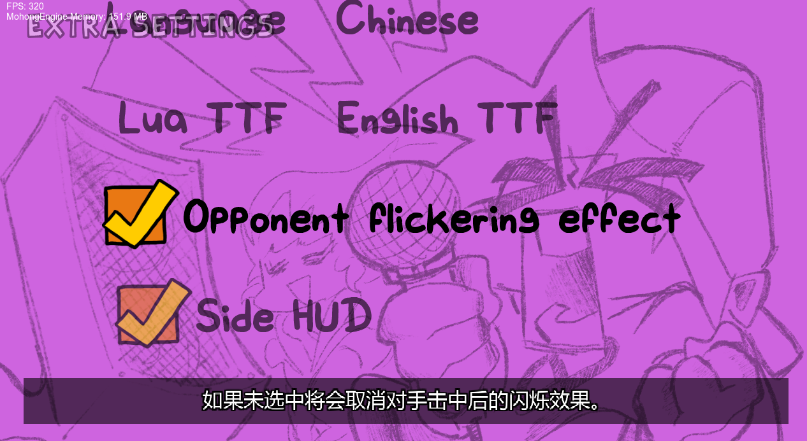
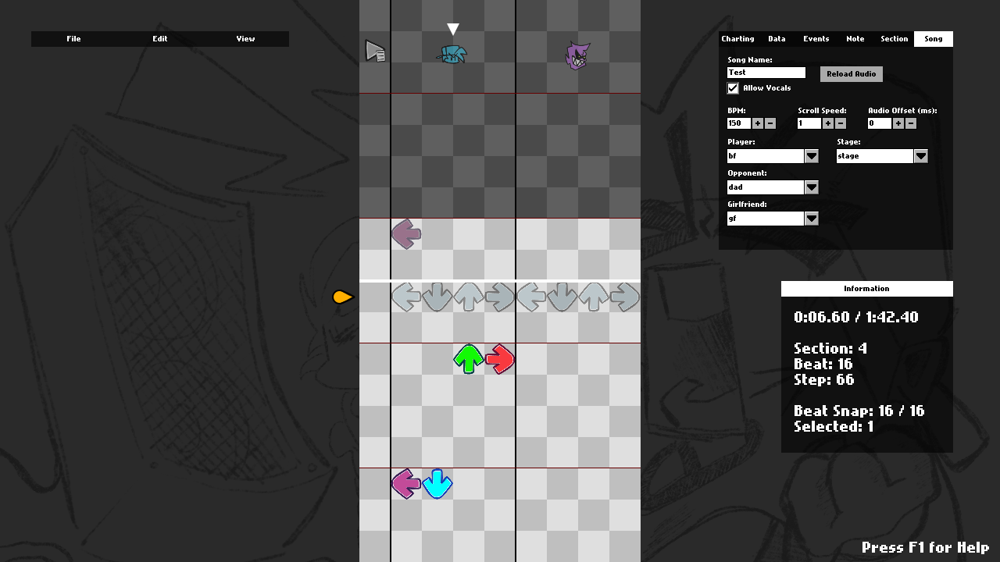

# Friday Night Funkin' - Mohong引擎 这是一个分支!!!!(基于Psych引擎)
(未上架Gamebanana) 旨在修复原版的诸多问题，同时保留其休闲玩法特性。也为编程新手提供更易上手的替代方案。

## 新增内容

新增多语言支持（虽然代码写得有点烂）（一堆if语句？）

## 安装指南:
你必须安装 [最新版Haxe](https://haxe.org/download/)，说真的，别再使用4.1.5了，它缺少一些功能。

先跟随《Friday Night Funkin'》源代码编译教程操作，之后你需要安装LuaJIT。

安装LuaJIT请执行：在命令提示符/PowerShell中输入 `haxelib git linc_luajit https://github.com/nebulazorua/linc_luajit`

...或者如果你不希望mod支持.lua脚本，直接删除Project.xml中的"LUA_ALLOWED"行

若使用Lua时出现StatePointer错误，在命令提示符/PowerShell中运行 `haxelib remove linc_luajit`，然后重新安装linc_luajit。

如需视频支持，在命令提示符/PowerShell中执行 `haxelip install hxCodec`

否则可以直接删除Project.xml中的"VIDEOS_ALLOWED"行

## 制作名单:
* mo_hong - 修改与中文翻译
* Shadow Mario - 程序员
* RiverOaken - 美术
* Yoshubs - 助理程序员

### 特别鸣谢
* bbpanzu - 前任程序员
* shubs - 新输入系统
* SqirraRNG - 崩溃处理程序和图表编辑器波形基础代码
* KadeDev - 修复了图表编辑器等问题并提交PR
* iFlicky - Psync和Tea Time作曲者，兼对话音效制作
* PolybiusProxy - .MP4视频加载库(hxCodec)
* Keoiki - 音符飞溅动画
* Smokey - 精灵图集支持
* Nebula the Zorua - LUA JIT分支及部分Lua重写
_____________________________________

# 特色功能

## 炫酷的动态对话窗:

## Mod支持
* 本引擎核心特色：可直接在源代码外编写.lua文件制作新周目，无需改动源代码！
* 内置Mod管理/禁用菜单

## 每周目至少有一处改动:
### 第一周:
  * 新增Dad左向演唱动画
  * 启用了原本未使用的舞台灯光
### 第二周:
  * BF和Skid & Pump都会触发"Hey!"动画
  * 雷电效果会伴随快速闪光和镜头微缩放
  * 为Monster歌曲添加过渡转场
### 第三周:
  * BF在Philly Nice期间会触发"Hey!"
  * Blammed歌曲高潮部分新增酷炫色闪效果
### 第四周:
  * Mom/Boyfriend更自然的头发物理效果（可能比第七周的还细腻 :eyes:）
  * 所有歌曲中Henchmen都会死亡。没错 :(
### 第五周:
  * Bottom Boppers和GF在Cocoa和Eggnog期间会触发"Hey!"动画
  * Winter Horrorland中GF在某些段落会放慢头部摆动
### 第六周:
  * Thorns歌曲的过场动画会隐藏HUD
  * 背景女孩在Instrumental的"Hey!"段落会有惊悚表现

## 图表编辑器升级与海量BUG修复

* 新增"事件"音符标注功能，可触发原版硬编码的特殊动作
* 歌曲BPM现在支持小数精度
* 可手动调整音符弹奏时间（毫秒级精度）
* 编辑器内可更改音符类型，内置两种示例类型：
  * 备用动画：强制播放备用动画（适用于Ugh/Stress等歌曲）
  * Hey：用"Hey"动画替代默认演唱动画，若BF击中该音符，GF也会触发"Hey!"

## 多种编辑器助力Mod制作

* 同时支持源代码修改和编译版使用！

## 故事模式菜单重制:

* 每首歌曲都有专属背景（除了教学关）
* 所有菜单角色现在使用独立精灵图，方便Mod制作

## 制作名单界面

* 可添加头像图标、名称、描述，以及玩家选中时按Enter键触发的跳转链接

## 成就系统
* 引擎内置16个示例成就供参考（查看Achievements.hx并在PlayState.hx中搜索"checkForAchievement"）

## 选项菜单:
* 可调整音符颜色、输入延迟、连击偏移、控件设置等
 * 在偏好设置中可开关下潜式谱面、居中谱面、抗锯齿、帧率、低画质模式、音符溅射效果、闪光特效等

## 其他游戏特性:
* 对手击中音符时，其对应的按键会发光
* 卡顿不再影响镜头运动和玩家图标缩放
* 部分第七周特性已移植（自由模式背景色、音符溅射）
* 在自由模式/故事模式中可按重置按钮清零分数
* 自由模式中按Space键可试听歌曲或调整滚动速度/受伤值等参数